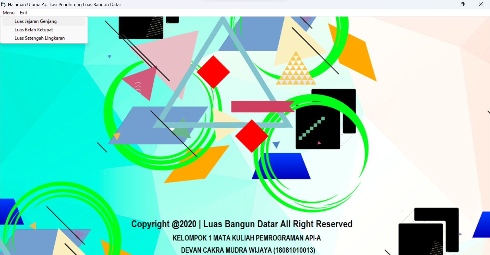
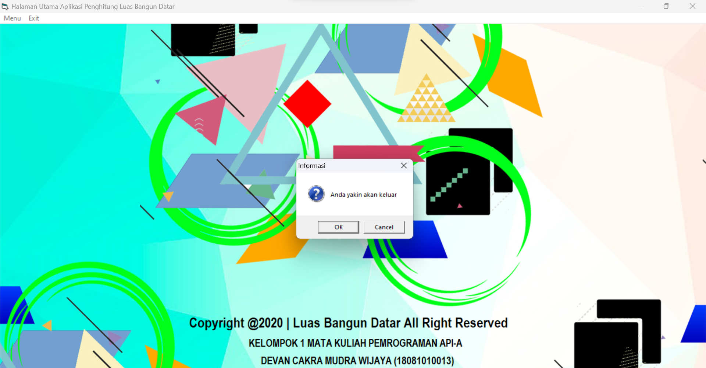
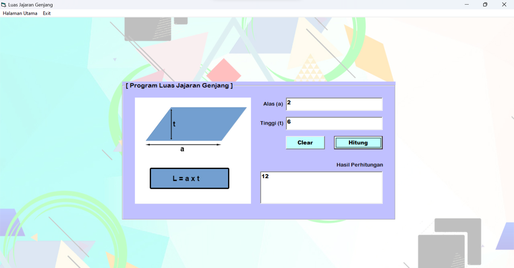
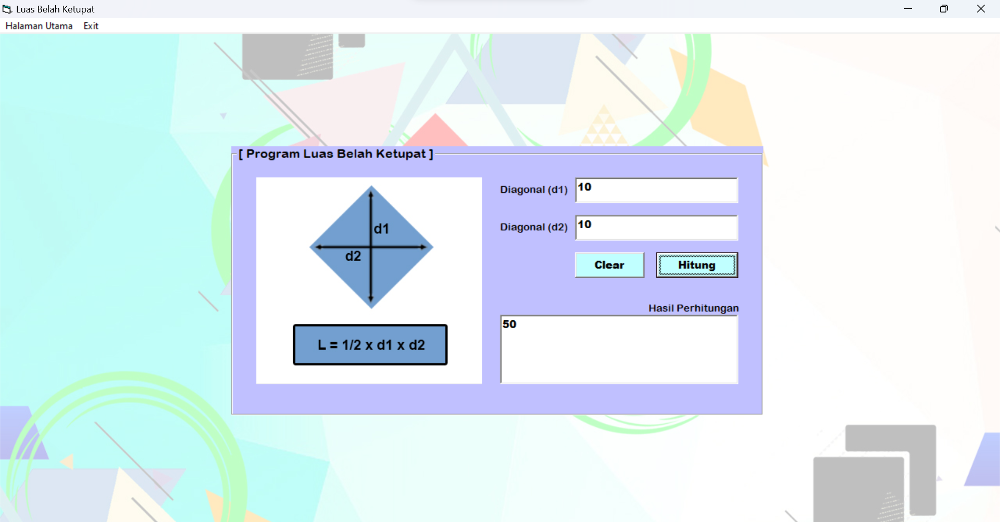

[](https://github.com/ellerbrock/open-source-badges/)
[](https://opensource.org/licenses/MIT)


# Aplikasi-Penghitung-Luas-Bangun-Datar-VB6
<strong>Tugas Pemrograman API</strong><br>
Aplikasi Penghitung Luas Bangun Datar.

<br>

## Kebutuhan Proyek
| Bagian | Deskripsi |
| --- | --- |
| Fitur | Komputasi, Validasi |
| Peralatan | Visual Basic 6.0 Enterprise |
| Sistem Operasi | Windows 10 |

<br>

## Unduh & Instal Visual Basic 6.0 Enterprise
<table><tr><td width="840">
  
```
https://bit.ly/VisualBasic6_Installer
```

</td></tr></table>

<br>

## Memulai
1. Unduh repositori ini.<br>
2. Ekstrak file.<br>
3. Buka direktori ``` Kelompok1_DevanCakraMW_18081010013 ```.<br>
4. Klik ``` Aplikasi Penghitung Luas Bangun Datar By Devan (18081010013)_original.exe ``` untuk menjalankan program aplikasi.<br>
5. Selamat menikmati [Selesai].

<br>

## Sorotan
<table>
<tr>
<th width="420">Beranda</th>
<th width="420">Validasi</th>
</tr>
<tr>
<td></td>
<td></td>
</tr>
</table>
<table>
<tr>
<th width="280">Luas Jajar Genjang</th>
<th width="280">Luas Belah Ketupat</th>
<th width="280">Luas Setengah Lingkaran</th>
</tr>
<tr>
<td></td>
<td></td>
<td></td>
</tr>
</table>

<br>

## Apresiasi
Jika karya ini bermanfaat bagi anda, maka dukunglah karya ini sebagai bentuk apresiasi kepada penulis dengan mengklik tombol ``` ⭐Bintang ``` di bagian atas repositori.

<br>

## LISENSI 
LISENSI MIT - Hak Cipta © 2020 - Devan C. M. Wijaya

Dengan ini diberikan izin tanpa biaya kepada siapa pun yang mendapatkan salinan perangkat lunak ini dan file dokumentasi terkait perangkat lunak untuk menggunakannya tanpa batasan, termasuk namun tidak terbatas pada hak untuk menggunakan, menyalin, memodifikasi, menggabungkan, mempublikasikan, mendistribusikan, mensublisensikan, dan/atau menjual salinan Perangkat Lunak ini, dan mengizinkan orang yang menerima Perangkat Lunak ini untuk dilengkapi dengan persyaratan berikut:

Pemberitahuan hak cipta di atas dan pemberitahuan izin ini harus menyertai semua salinan atau bagian penting dari Perangkat Lunak.

DALAM HAL APAPUN, PENULIS ATAU PEMEGANG HAK CIPTA DI SINI TETAP MEMILIKI HAK KEPEMILIKAN PENUH. PERANGKAT LUNAK INI DISEDIAKAN SEBAGAIMANA ADANYA, TANPA JAMINAN APAPUN, BAIK TERSURAT MAUPUN TERSIRAT, OLEH KARENA ITU JIKA TERJADI KERUSAKAN, KEHILANGAN, ATAU LAINNYA YANG TIMBUL DARI PENGGUNAAN ATAU URUSAN LAIN DALAM PERANGKAT LUNAK INI, PENULIS ATAU PEMEGANG HAK CIPTA TIDAK BERTANGGUNG JAWAB, KARENA PENGGUNAAN PERANGKAT LUNAK INI TIDAK DIPAKSAKAN SAMA SEKALI, SEHINGGA RISIKO ADALAH MILIK ANDA SENDIRI.
